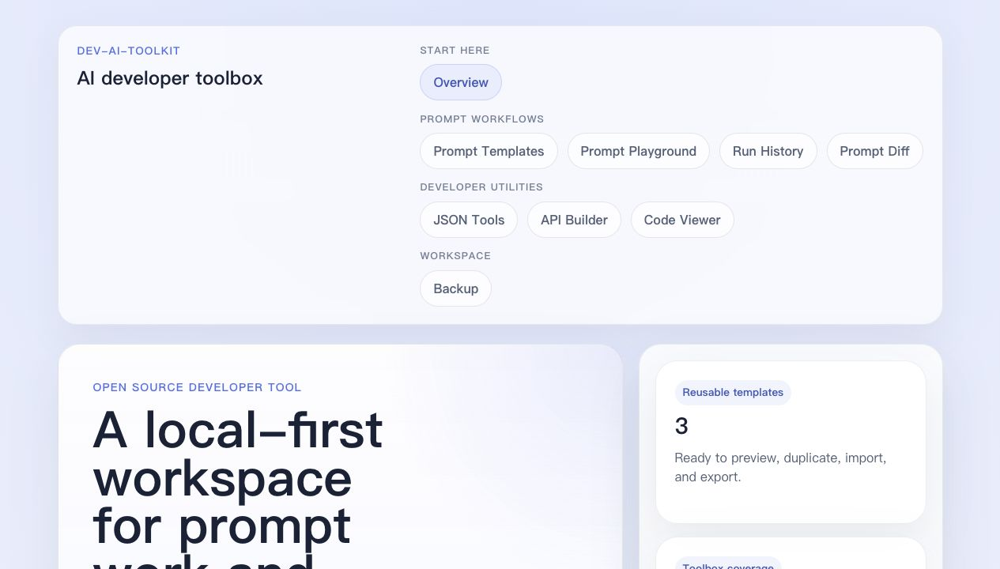

**Languages:** English | [简体中文](./README.zh-CN.md)

# dev-ai-toolkit

[](https://github.com/as569951728/dev-ai-toolkit/actions/workflows/ci.yml)

A practical open-source AI toolkit for developers, built with React, Vite, and TypeScript.

This project is a local-first **AI developer toolbox** for a small set of practical workflows such as prompt authoring, payload inspection, request scaffolding, and output review.

## Why This Project

Developers often use AI across repeated workflows:

- Reusing prompt templates for debugging, code review, and API design
- Organizing AI inputs, request data, and output review in a clearer way
- Building lightweight internal tooling without a heavy backend at the start

`dev-ai-toolkit` is an attempt to keep those workflows in one place without introducing a backend too early.

## Current Features

The current version includes:

- Overview landing page
- Prompt template list, create, edit, detail, duplicate, archive, restore, and delete flows
- Prompt template search and tag filtering
- Prompt template import and export via JSON
- Prompt Playground with variable detection and live prompt preview
- Prompt Diff for comparing prompt revisions and variable drift
- Prompt Run History for browsing, filtering, searching prompt text, variables, and notes, opening detail views, adding notes, importing/exporting run JSON, deleting local runs, and reusing saved prompt runs
- JSON Tools for formatting, validating, and minifying payloads
- API Builder for drafting request configurations and fetch snippets
- Code Viewer for reading code or generated output in single or compare mode
- Workspace Backup for exporting and importing local templates, saved runs, notes, and recent playground shortcuts as JSON
- Recent template history in the playground
- Local browser persistence via `localStorage`
- Feature-based code organization
- ESLint, tests, and GitHub Actions CI

## Tech Stack

- React
- Vite
- TypeScript
- React Router

## Project Structure

```txt
dev-ai-toolkit/
├── docs/
├── public/
├── src/
│   ├── app/
│   │   ├── router/
│   │   ├── providers/
│   │   └── styles/
│   ├── components/
│   │   ├── common/
│   │   ├── layout/
│   │   └── ui/
│   ├── features/
│   │   ├── home/
│   │   ├── api-builder/
│   │   ├── code-viewer/
│   │   ├── json-tools/
│   │   ├── prompt-diff/
│   │   ├── prompt-playground/
│   │   ├── prompt-run-notes/
│   │   ├── prompt-runs/
│   │   ├── prompt-templates/
│   │   └── workspace-backup/
│   ├── hooks/
│   ├── lib/
│   ├── types/
│   ├── constants/
│   ├── assets/
│   ├── App.tsx
│   └── main.tsx
├── .github/
├── CONTRIBUTING.md
├── LICENSE
├── README.md
├── README.zh-CN.md
└── package.json
```

## Getting Started

### Requirements

- Node.js 20 or later
- npm 10 or later recommended

### Installation

```bash
npm install
```

### Run In Development

```bash
npm run dev
```

Then open the local URL shown by Vite in your terminal, usually:

```txt
http://localhost:5173
```

### Build For Production

```bash
npm run build
```

### Run Tests

```bash
npm run test
```

### Lint The Codebase

```bash
npm run lint
```

### Check Dependencies

```bash
npm run audit
```

### Preview The Production Build

```bash
npm run preview
```

## Live Demo

There is no verified public demo for the latest `main` branch yet. If you need
to try the current version, run the app locally for now.

- Candidate URL under verification: `https://dev-ai-toolkit.vercel.app`
- Tracking issue: [#14](https://github.com/as569951728/dev-ai-toolkit/issues/14)

See [docs/deployment.md](./docs/deployment.md) for the current deployment notes.

## Visual Walkthrough

The current UI is still small and local-first. These screenshots are captured
from the running app and are meant to show the real workflow rather than a
polished marketing mockup.



For the main prompt workflow path, see
[docs/prompt-workflow-walkthrough.md](./docs/prompt-workflow-walkthrough.md).

### Deploy To Vercel

This app can be deployed as a static Vite site. See
[docs/deployment.md](./docs/deployment.md) for the setup and verification
steps.

## Current Modules

The toolbox is currently organized around two capability groups.

| Group | Module | Current capabilities | Notes |
| --- | --- | --- | --- |
| Core | Overview | Introduces the module groups, main workflow, and near-term direction | Landing page for first-time users |
| Prompt Workflows | Prompt Templates | Create, edit, duplicate, archive, restore, delete, filter, import, and export templates | Active templates can open in the playground; all templates can open filtered run history |
| Prompt Workflows | Prompt Playground | Select templates, fill variables, preview output, save run snapshots, and keep recent template usage | Main path for generating reusable prompt output |
| Prompt Workflows | Prompt Diff | Compare prompt revisions, detect variable drift, and inspect line-level wording changes | Best used after editing or templating changes |
| Prompt Workflows | Prompt Run History | Browse saved runs, filter by template, search saved prompt text, captured variables, and note content, open run details, add notes, import or export a single run, delete stale runs, and reopen output in downstream tools | Dedicated history view for saved prompt output |
| Developer Utilities | JSON Tools | Format, validate, minify, copy, and sample JSON payloads | Useful for debugging and payload cleanup |
| Developer Utilities | API Builder | Draft request URLs, headers, query params, JSON bodies, and `fetch` snippets | Local request scaffolding only |
| Developer Utilities | Code Viewer | Inspect generated text or code in single or compare mode | Supports prompt and output review workflows |
| Workspace | Workspace Backup | Export and import local templates, saved runs, notes, and recent playground shortcuts as versioned JSON | Manual backup for the current browser profile |

The current storage model is intentionally local-first:

- A few starter templates are seeded on first load
- User changes and saved runs are persisted in `localStorage`
- Workspace backups can export and restore local templates, saved runs, notes, and recent playground shortcuts
- Repository boundaries are in place so future API-backed work does not require rewriting page structure first

## How It Works

The most complete workflow in the current version looks like this:

1. Start in `Prompt Templates` and move into `Prompt Playground`
2. Save a prompt run from the playground
3. Open filtered `Prompt Run History` for the active template
4. Search saved runs by template name, saved prompt text, captured variable, or note content when reviewing older output
5. Review a saved run detail page, add a short note, import or export a run as JSON, or delete stale local runs
6. Continue into `Prompt Diff` or `Code Viewer`

Other modules such as `JSON Tools` and `API Builder` are available as supporting utilities.

## Development Notes

Current maintenance priorities:

- Keep the codebase small and easy to review
- Prefer incremental improvements over large rewrites
- Improve connected workflows before adding many new standalone pages
- Keep persistence and testing credible as the local data model grows

## Roadmap

Current next steps include:

- Better connections across existing modules
- Stronger data boundaries for future API-backed growth
- More workflow-level test coverage
- Better open-source documentation and examples

See the longer-term product direction in [docs/roadmap.md](./docs/roadmap.md).
For contributor-facing code structure notes, see [docs/architecture.md](./docs/architecture.md).

## Releases

- [Changelog](./CHANGELOG.md)
- [v0.1.0 release notes](./docs/releases/v0.1.0.md)

## Contributing

Contributions are welcome. Please read [CONTRIBUTING.md](./CONTRIBUTING.md) before opening a pull request.

## Security

For security reporting guidance, see [SECURITY.md](./SECURITY.md).

## License

This project is licensed under the [MIT License](./LICENSE).
