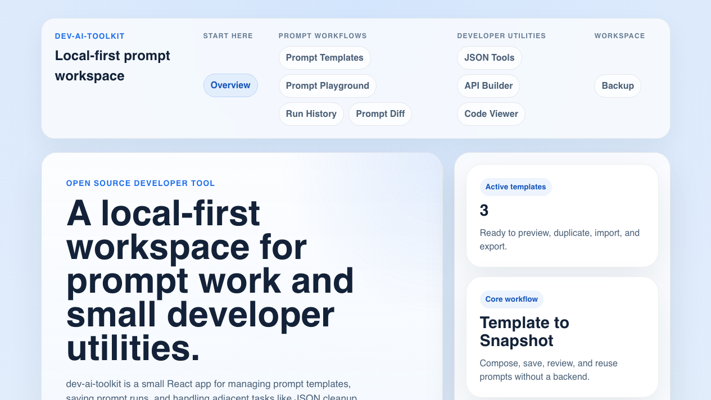

# dev-ai-toolkit

[](https://github.com/as569951728/dev-ai-toolkit/actions/workflows/ci.yml)

**语言版本：** [English](./README.md) | 简体中文

`dev-ai-toolkit` 是一组本地优先的开发辅助工具，用来维护 prompt 模板、保存运行记录、清理 JSON，并整理 API 请求草稿。

当前项目主要围绕几类日常开发场景展开：

- 维护和复用 prompt 模板
- 预览替换变量后的 system prompt 和 user prompt
- 保存 prompt 快照并回看历史
- 处理 JSON、接口草稿和文本输出
- 手动备份和恢复当前浏览器里的本地工作区数据

## 适合做什么

这个仓库更适合下面这些场景：

- 为代码审查、接口设计、问题排查等重复任务维护 prompt 模板
- 在本地整理 prompt 模板、变量和已保存快照
- 用 JSON Tools、API Builder、Code Viewer 处理相邻的开发辅助工作

目前它还是一个纯前端、本地优先的工具，没有后端和账号系统。

## 当前功能

- Overview 首页
- Prompt Templates
  - 列表、详情、新建、编辑、复制、归档、恢复、删除
  - 搜索、标签筛选
  - JSON 导入 / 导出
- Prompt Playground
  - 选择模板
  - 识别 `{{variable_name}}`、`{{pull-request.title}}` 等变量
  - 填写变量并实时预览
  - 变量未填写时保留占位符并提示剩余数量，不阻止复制或保存
  - 保存最近使用模板
  - 保存 run snapshot
- Prompt Diff
  - 比较 prompt 文本
  - 检查变量占位符变化
  - 从模板版本历史直接比较旧版本和当前版本
- Prompt Run History
  - 浏览已保存 runs
  - 按模板过滤
  - 按最新或最早保存时间排序
  - 按模板名、prompt 文本、变量或备注内容搜索
  - 在列表中预览捕获到的变量
  - 从列表直接复制带分段标签的完整 prompt
  - 打开单条 run 详情
  - 为单条 run 保存维护备注
  - 在历史列表中查看备注摘要
  - 从历史列表直接进入 Prompt Diff 和源模板对比
  - 导出单条 run 的 JSON 文件
  - 删除不再需要的本地 run
  - 跳回模板详情、在 Playground 重开，或把已保存 prompts 带入新的模板草稿
- JSON Tools
  - 格式化、压缩、校验、复制
  - 从单条 run 详情加载捕获到的变量对象
- API Builder
  - 组织 URL、Query、Headers、JSON Body
  - 生成 `fetch` 示例代码和 cURL 命令
- Code Viewer
  - 单栏 / 双栏查看文本和代码输出
  - 复制内容
- Workspace Backup
  - 导出当前本地模板、已保存 runs、run notes 和最近使用模板入口
  - 从 dev-ai-toolkit 导出的 JSON 文件恢复本地工作区
  - 模板和 runs 按 id 合并，run notes 按 runId 合并

## 技术栈

- React
- Vite
- TypeScript
- React Router
- Vitest
- ESLint

## 项目结构

```txt
dev-ai-toolkit/
├── docs/
├── public/
├── src/
│   ├── app/
│   ├── components/
│   ├── features/
│   ├── lib/
│   ├── types/
│   ├── App.tsx
│   └── main.tsx
├── .github/
├── CONTRIBUTING.md
├── LICENSE
├── README.md
├── README.zh-CN.md
└── package.json
```

## 快速开始

### 环境要求

- Node.js 20.19+，或 Node.js 22.12+
- 推荐使用 npm 10 或更高版本

### 安装依赖

```bash
npm install
```

### 本地开发

```bash
npm run dev
```

默认会启动在 Vite 输出的本地地址，通常是：

```txt
http://localhost:5173
```

### 构建

```bash
npm run build
```

### 测试

```bash
npm run test
```

浏览器冒烟测试覆盖核心 Prompt 工作流和 Workspace Backup 往返恢复。首次运行前安装
Chromium：

```bash
npx playwright install chromium
npm run test:e2e
```

### 代码检查

```bash
npm run lint
```

### 依赖安全检查

```bash
npm run audit
```

## Live Demo

公开部署地址：
[https://dev-ai-toolkit.vercel.app](https://dev-ai-toolkit.vercel.app)。

2026-07-15 已使用干净浏览器对应用版本
[`f487910`](https://github.com/as569951728/dev-ai-toolkit/commit/f4879101d913c9b4608d272dbac3b88760b0b599)
完成验证，包括新建模板、Playground 变量组合、保存和查看运行记录、导出工作区，
以及刷新嵌套路由。Demo 中的数据只保存在当前浏览器，不会同步到服务端。

当前部署说明见 [docs/deployment.md](./docs/deployment.md)。

## 界面和使用路径

下面的截图来自当前运行中的应用，用来展示真实界面状态，不是额外制作的营销图。



主 prompt 工作流说明见
[docs/prompt-workflow-walkthrough.md](./docs/prompt-workflow-walkthrough.md)。

### 部署说明

这个项目可以作为 Vite 静态站点部署到 Vercel。具体设置和验证步骤见
[docs/deployment.md](./docs/deployment.md)。

## 模块概览

| 分组 | 模块 | 当前能力 | 备注 |
| --- | --- | --- | --- |
| Core | Overview | 介绍模块分组、主路径和当前阶段方向 | 首页入口 |
| Prompt Workflows | Prompt Templates | 创建、编辑、复制、归档、恢复、比较版本、删除、筛选、导入、导出模板 | 活跃模板可以进入 Playground，所有模板都可以查看过滤后的 Run History |
| Prompt Workflows | Prompt Playground | 选择模板、填变量、预览或复制带分段标签的完整 prompt、保存 run snapshot、保留最近使用模板 | 当前主工作流入口 |
| Prompt Workflows | Prompt Diff | 比较 prompt 文本、变量变化和行级差异 | 可从模板版本历史或已保存 run 的复核流程直接进入 |
| Prompt Workflows | Prompt Run History | 浏览 runs、按模板过滤、按保存时间排序、预览捕获变量、搜索 prompt 文本、变量或备注、查看详情、复制完整 prompt、添加备注、导出或删除单条 run、和源模板对比、在 Playground 或新模板草稿中复用已保存 prompts | 已保存 prompt 快照的历史视图 |
| Developer Utilities | JSON Tools | 格式化、校验、压缩、复制、加载示例，或从 Run Detail 加载捕获到的变量对象 | 适合检查已保存输入和其他 JSON 载荷 |
| Developer Utilities | API Builder | 组织请求参数并生成 `fetch` 代码和 cURL 命令 | 本地请求草稿工具 |
| Developer Utilities | Code Viewer | 单栏 / 双栏查看文本和代码输出 | 适合审阅 prompt 或生成结果 |
| Workspace | Workspace Backup | 导出和导入本地模板、runs、notes 和最近使用模板入口的版本化 JSON | 当前浏览器 profile 的手动备份入口 |

## 数据与隐私

应用不会把 prompt 模板、已保存 runs、notes 或生成的请求代码发送到项目后端。
持久化的工作流数据会留在当前浏览器 profile 中，直到你主动导出或删除。

应用内部打开 `Prompt Diff` 和 `Code Viewer` 时，会通过浏览器 history state
传递 prompt 或请求内容，而不是把正文放进 URL。已保存 run 的链接只携带 run ID，
具体内容从本地存储读取。旧版带正文参数的链接仍可打开，但页面读取后会从当前
地址中移除这些参数。

Prompt Templates 和 Run History 的搜索词会以 `q` 保留在 URL 中，便于返回列表
时恢复筛选条件，也可以保存为书签。不要把敏感 prompt 正文作为搜索词，因为它会
出现在浏览器历史和复制后的列表链接中。

本地优先不等于加密存储。能够访问当前浏览器 profile 或开发者工具的人，可能读到
其中的数据。不要在工作区中保存生产环境密钥、访问令牌或其他敏感凭据。

## 典型使用路径

当前比较完整的一条路径是：

1. 在 `Prompt Templates` 中创建或整理模板
2. 进入 `Prompt Playground` 填变量并预览组合后的 prompts，可以复制到外部 AI 工具
3. 将有复用价值的内容保存为 run snapshot
4. 在 `Prompt Run History` 里按最新或最早时间回看某个模板的 prompt 快照，也可以按 prompt 文本、变量或备注内容找回旧记录
5. 在列表中直接复制完整 prompt、查看捕获变量，或从单条 run 详情把变量对象带入 `JSON Tools`；也可以和源模板进入 `Prompt Diff` 对比、补充维护备注、导出 JSON，或把已保存 prompts 带入新的模板草稿后再编辑保存
6. 需要迁移或清理浏览器数据前，到 `Workspace Backup` 导出当前本地工作区

## 当前限制

- 所有数据都存放在浏览器 `localStorage`
- 没有后端、账号系统和跨设备同步
- 同一浏览器配置下的其他标签页会在存储变化后刷新模板、runs、备注和最近使用模板
- 干净的模板和备注编辑器会采用刷新后的内容；未保存草稿会保留并显示提示，不会被静默覆盖
- 如果正在编辑的模板或带有未保存备注的 run 被其他标签页删除，可以把当前草稿恢复到新的本地记录
- 并发编辑仍按浏览器最后一次持久化写入为准；提示只保护当前可见草稿，不会自动合并字段
- 运行记录和备份恢复都只作用于当前浏览器环境
- 一些开发辅助模块目前还是轻量工具页，和 prompt 主链路相比更独立

## 路线图

后续会继续做这些方向：

- 当前 `main` 改动推送后，验证公开 Demo 是否同步
- 持续覆盖本地导入、导出和失败恢复的回归场景
- 暂停扩展辅助工具，先收集当前 Prompt 工作流的真实使用反馈
- 在 CI、Demo、文档和 release notes 一致后准备 `v0.2.0`

复盘后的实现路线图见 [docs/roadmap.md](./docs/roadmap.md)。

代码结构说明见 [docs/architecture.md](./docs/architecture.md)。

## 发布记录

- [Changelog](./CHANGELOG.md)
- [v0.1.0 release notes](./docs/releases/v0.1.0.md)

## 贡献

欢迎提交 issue 或 pull request。开始之前请先阅读 [CONTRIBUTING.md](./CONTRIBUTING.md)。

## 安全

安全问题报告方式见 [SECURITY.md](./SECURITY.md)。

## License

本项目使用 [MIT License](./LICENSE)。
