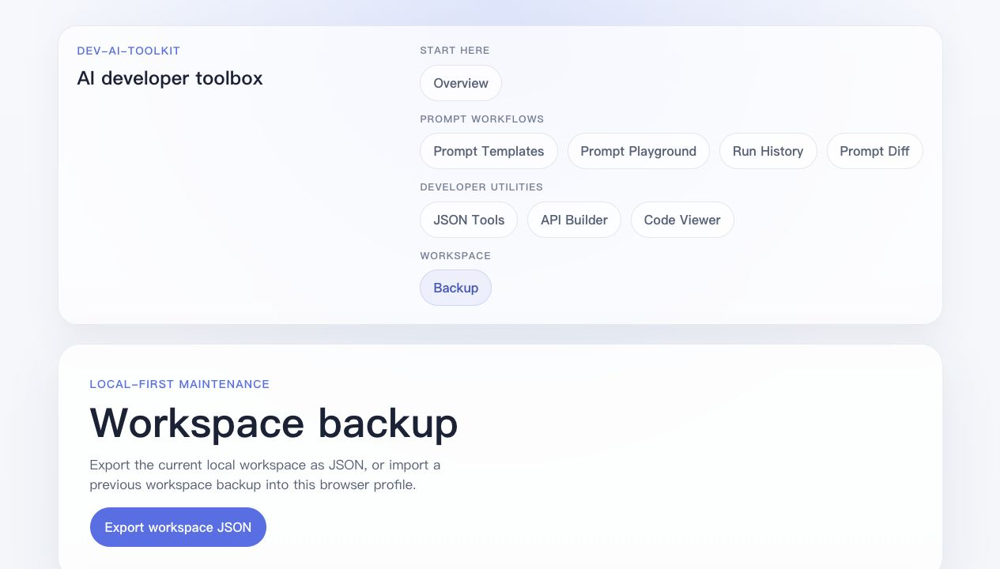

# Prompt Workflow Walkthrough

This walkthrough describes the main local-first workflow currently supported by
dev-ai-toolkit. It uses the existing prompt template, playground, run history,
note, export, and workspace backup features.

## Current UI

## 1. Start With A Prompt Template

Open **Prompt Templates** to choose an existing template or create a new one.
Templates are meant for repeated development tasks such as code review, bug
triage, API design, and release note drafting.

Useful actions in the current template flow:

- Search and filter templates by tag.
- Create, edit, duplicate, archive, restore, or delete local templates.
- Export or import prompt templates as JSON.
- Open a template in the playground when you are ready to fill variables.

Archived templates stay available for preview, restore, and run-history review,
but they are not offered as active Playground templates.

## 2. Fill Variables In Prompt Playground

Open **Prompt Playground** from a template. The playground detects variables in
the template text and shows a form for filling them.

Use this step to:

- Check the final system and user prompt before using it elsewhere.
- Keep the prompt output tied to a template version.
- Save a prompt run when the output is useful enough to review later.

## 3. Save And Review Prompt Runs

Saved runs appear in **Run History**. This is the current activity trail for
prompt work in the app.

Run History supports:

- Filtering runs by source template.
- Searching by template name, saved prompt text, captured variable, and note
  content.
- Opening a detail page for a saved run.
- Reopening output in Code Viewer.
- Comparing a saved run with its source template in Prompt Diff.

## 4. Add Notes And Export Individual Runs

On a run detail page, you can add a short note to explain why the run was kept
or what should be reviewed later. Individual runs can also be exported as JSON.

This is useful for small review loops where the prompt output needs context but
does not yet need a backend or shared account model.

## 5. Back Up The Local Workspace

The app stores data in the browser, so the **Workspace Backup** page exists as a
manual safety net.

The workspace backup currently includes:

- Prompt templates and revisions
- Saved prompt runs
- Notes attached to prompt runs

Exported backups are versioned JSON files. Importing a backup merges prompt
templates and runs by `id`, and run notes by `runId`, so a saved run keeps at
most one note after import.

## Known Limits

- Data is still local to the current browser profile.
- There is no account system, remote sync, or shared team workspace yet.
- Screenshots in this document are captured from the local app, not a hosted
  analytics or production environment.
