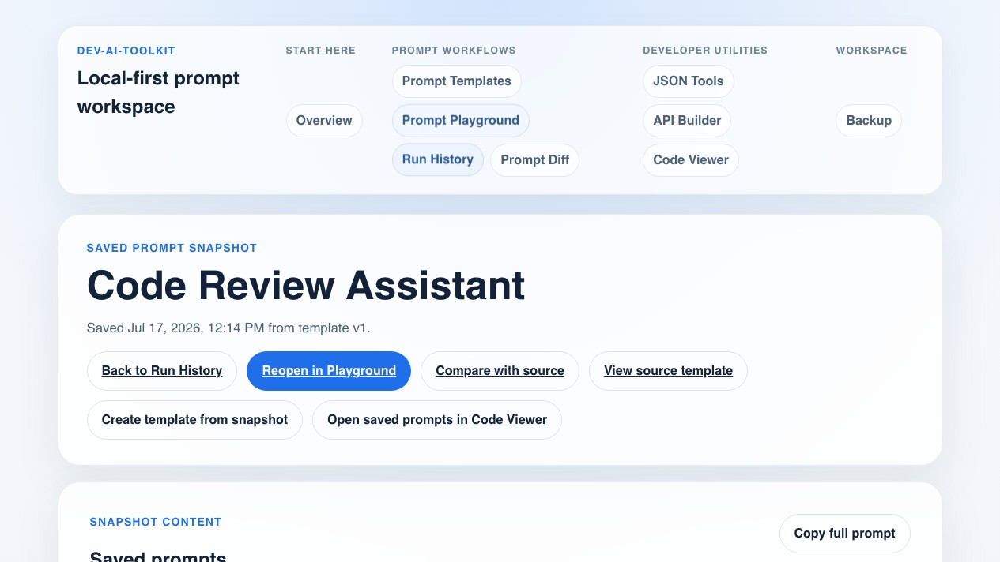
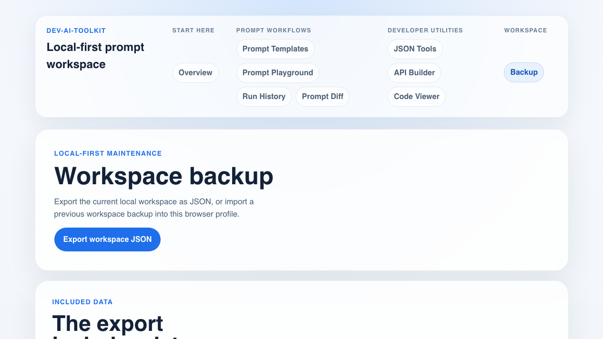

# Prompt Workflow Walkthrough

This walkthrough describes the main local-first workflow currently supported by
dev-ai-toolkit. It uses the existing prompt template, playground, run history,
note, export, and workspace backup features.

## Current UI

## Short Public Demo Trial

This trial uses public example content so the same path can be repeated without
sharing private prompt text or repository data.

1. Open the [public Demo](https://dev-ai-toolkit.vercel.app) and choose
   **Open Code Review Assistant**.
2. Enter `dev-ai-toolkit` for **Repository Name**.
3. Enter `API Builder request generation` for **Change Scope**.
4. Confirm that both placeholders are replaced in the composed prompt, then
   choose **Save prompt snapshot**.
5. Open the saved run and add the note
   `Check whether generated request snippets preserve input safely.`
6. Return to **Run History** and search for `API Builder` to confirm that the
   snapshot and note remain available in the current browser profile.

The expected result is one local saved run linked to the Code Review Assistant
template version, with the two captured variable values and the review note.
The app does not send this prompt to a model or remote API.

If a step is unclear, repetitive, or produces a different result, use the
[workflow feedback form](https://github.com/as569951728/dev-ai-toolkit/issues/new?template=usage_feedback.yml)
and mention the step where the result diverged. Do not include credentials,
private prompts, or private project data.

## 1. Start With A Prompt Template

Open **Prompt Templates** to choose an existing template or create a new one.
Templates are meant for repeated development tasks such as code review, bug
triage, API design, and release note drafting.

Useful actions in the current template flow:

- Search and filter templates by tag.
- Create, edit, duplicate, archive, restore, or delete local templates.
- Compare an earlier revision with the current template in Prompt Diff before
  deciding whether to restore it.
- Export or import prompt templates as JSON.
- Open a template in the playground when you are ready to fill variables.

Archived templates stay available for preview, restore, and run-history review,
but they are not offered as active Playground templates.

## 2. Fill Variables In Prompt Playground

Open **Prompt Playground** from a template. The playground detects variables in
the template text and shows a form for filling them.

Variable names can use letters, numbers, underscores, hyphens, dots, and
camel-case naming. For example, `{{repository_name}}`, `{{repositoryName}}`,
and `{{pull-request.title}}` all become editable fields. Dotted names remain
flat keys; they do not create nested data.

An empty or whitespace-only value leaves the original placeholder in the
composed prompt. The preview shows how many variables are unresolved, but it
does not block copying or saving a partial prompt snapshot. Non-empty values
keep their entered whitespace so code, logs, and diffs are not reformatted.

Use this step to:

- Check the final system and user prompt before using it elsewhere.
- Copy both labeled prompt sections in one action for use in an external AI
  tool.
- Keep the composed prompts tied to a template version.
- Save a prompt snapshot when the composed prompts are useful enough to review
  later.

## 3. Save And Review Prompt Runs

Saved runs appear in **Run History**. This is the current activity trail for
prompt work in the app.

Run History supports:

- Filtering runs by source template.
- Sorting saved runs from newest or oldest.
- Previewing captured variables directly on the run cards.
- Searching by template name, saved prompt text, captured variable, and note
  content.
- Copying the complete labeled prompt directly from a run card, with local
  success or error feedback.
- Opening a detail page for a saved run.
- Reopening a snapshot from its Run History card with the captured variables
  when the source template is still active.
- Reopening saved prompts in Code Viewer.
- Opening the captured variable object in JSON Tools from Run Detail. JSON
  Tools loads the local run by ID and starts with its saved variables as
  formatted JSON; the run itself is not changed.
- Comparing a saved run with its source template in Prompt Diff from the list
  or detail page.

## 4. Add Notes And Import Or Export Individual Runs

On a run detail page, you can copy the full labeled prompt again or add a short
note to explain why the run was kept and what should be reviewed later.
You can also start a new template draft from the saved system and user prompts.
The create form is prefilled but does not save automatically. Because a run
stores resolved prompt text, review the draft and add any reusable variable
placeholders again before creating the template.

Individual runs can also be exported as JSON with the matching source template
revision when it is still available locally. The Run History page can import
one of those JSON files later, including its saved note when the note belongs to
the exported run. A single-run import restores the prompt snapshot and note
only. Any embedded source revision is validated as provenance context; it does
not create or replace a template in the local library. Use Workspace Backup
when templates and run history need to move together.

This is useful for small review loops where a prompt snapshot needs context but
does not yet need a backend or shared account model.

## 5. Back Up The Local Workspace

The app stores data in the browser, so the **Workspace Backup** page exists as a
manual safety net.

The workspace backup currently includes:

- Prompt templates and revisions
- Saved prompt runs
- Notes attached to prompt runs
- Recent playground template shortcuts

Exported backups are versioned JSON files. Importing a backup merges prompt
templates and runs by `id`, and run notes by `runId`, so a saved run keeps at
most one note after import. Selecting a valid file first shows the number of
records that will be created or updated. The local workspace is not changed
until that preview is confirmed.

Workspace backups use stricter input rules than the general template importer:
template IDs and run IDs must be unique, and the file can contain only one note
for each run. This keeps the preview counts unambiguous. A backup can omit the
recent-template shortcut collection; when it includes that collection, the
confirmed import replaces the local shortcut list after removing duplicates
and references to unavailable templates.

Saved runs remain valid when their source template is no longer present. Each
run contains the composed prompts and captured variables needed for later
review, so deleting a template does not discard its history. Run notes are
different: a note must reference a run included in the same backup. Recent
template shortcuts that do not match an imported or existing template are
skipped.

## Known Limits

- Data is still local to the current browser profile.
- There is no account system, remote sync, or shared team workspace yet.
- Other tabs in the same browser profile refresh persisted workflow data, but
  concurrent edits still use the last browser write without automatic merging.
- Screenshots in this document are captured from the local app, not a hosted
  analytics or production environment.
